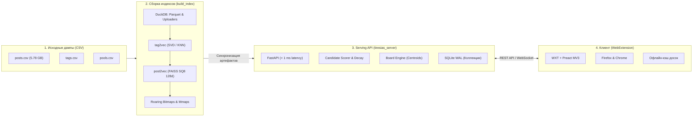

# TIRESIAS Recommendation Engine

> **TIRESIAS** — это персональная рекомендательная система и браузерный ассистент вдохновленный Pinterest для Booru-платформ (на данный момент только e621/e926). Вместо того чтобы вручную подбирать комбинации тегов, пользователь получает живой персональный поток: умную адаптивную ленту рекомендаций и тематические доски, которые сами находят подходящие по настроению и стилю посты. Проект работает как внешняя надстройка и бесшовно встраивается в привычный интерфейс сайта через расширение.

---

## 🏛️ Архитектура системы

Комплекс состоит из четырёх взаимосвязанных уровней:



1. **`build_index/`** — математический конвейер индексации 5.16M постов: конвертация в партиционированный Parquet, DuckDB-экстракция авторов, SVD-эмбеддинги тегов, агрегация постов и 8-битное FAISS-квантование.
2. **`tiresias_server/`** — легковесный FastAPI сервис. Zero-copy чтение бинарных mmaps, динамический расчет центроидов досок $\vec{c}_B$, многофакторный скоринг, побитовая цензура и режим техобслуживания (`Maintenance Mode`).
3. **`tiresias_extension/`** — кроссбраузерное расширение (Firefox / Chrome MV3) на Preact с локальным кэшированием досок и лентой рекомендаций.
4. **`tools/`** — автоматизированный оркестратор обновления артефактов (`updater.py`), скрипты синхронизации и утилиты валидации документации.

---

## ⚡ Быстрый старт

### 1. Проверка окружения и исходных данных
```cmd
run_updater.bat --step prereq
```
*(на Linux: `./run_updater.sh --step prereq`)*

### 2. Сборка математических индексов (полный цикл)
```cmd
run_updater.bat --step build --workers 12
```

### 3. Запуск сервера обслуживания
```cmd
cd tiresias_server
uvicorn app.main:app --host 0.0.0.0 --port 8000
```
Интерактивная документация Swagger UI доступна по адресу: `http://localhost:8000/docs`

### 4. Автоматическое обновление и деплой
Для выполнения полного цикла (бэкап базы данных, сборка новых артефактов и деплой на целевые машины из `tools/deploy_targets.json`):
```cmd
run_updater.bat --all
```

---

## 🔍 Проверка свежести документации (Doc Hash Integrity)

Чтобы убедиться, что документация соответствует реальному состоянию кода на диске, запустите встроенный чекер:
```cmd
check_docs.bat
```
*(на Linux: `./check_docs.sh`)*

Чекер парсит документацию, вычисляет нормализованные кроссплатформенные хеши SHA-256 (независимые от CRLF/LF) и сообщает статус каждого файла:
- `[OK]` — код совпадает с описанным в документации на 100%.
- `[CHANGED]` — файл модифицировался после написания документации.
- Для автоматического обновления хешей в доках: `check_docs.bat --update`.

---

## 📋 Манифест актуальности ключевых файлов проекта

Следующие контрольные суммы зафиксированы в документации:

| Файл | Хеш (SHA-256) | Дата фиксации | Описание |
| :--- | :--- | :--- | :--- |
| `tools/updater.py` | `6b67c77c` | 2026-09-21 | Оркестратор полного цикла обновления артефактов и обслуживания |
| `tools/run_updater.bat` | `b69cd115` | 2026-09-21 | Переносимый лаунчер обновления (Windows) |
| `tools/run_updater.sh` | `b65eb6a0` | 2026-09-21 | Переносимый лаунчер обновления (Linux / POSIX) |
| `tools/check_docs.py` | `d3c34df3` | 2026-09-21 | Инструмент проверки актуальности кодовой базы и документации |
| `tools/check_docs.bat` | `57cc98b0` | 2026-09-21 | Лаунчер проверки свежести документации (Windows) |
| `tools/check_docs.sh` | `14db810e` | 2026-09-21 | Лаунчер проверки свежести документации (Linux) |
| `run_updater.bat` | `6936a492` | 2026-09-21 | Корневой forwarder лаунчера обновления (Windows) |
| `run_updater.sh` | `95e36f7d` | 2026-09-21 | Корневой forwarder лаунчера обновления (Linux) |
| `check_docs.bat` | `eb85e20e` | 2026-09-21 | Корневой forwarder проверки документации (Windows) |
| `check_docs.sh` | `d558dce7` | 2026-09-21 | Корневой forwarder проверки документации (Linux) |
| `tiresias_server/app/main.py` | `ab9518b1` | 2026-09-21 | Точка входа Serving FastAPI сервера |
| `tiresias_server/app/core/engine.py` | `fe2dc039` | 2026-09-21 | Главный синглтон движка рекомендаций |
| `tiresias_server/app/core/mmaps.py` | `86780c00` | 2026-09-21 | Zero-copy доступ к метаданным постов через системный mmap |
| `tiresias_server/app/core/faiss_wrapper.py` | `2b8f8d56` | 2026-09-21 | Обертка векторного индекса FAISS SQ8 |
| `tiresias_server/app/core/bitmaps.py` | `aa9aa079` | 2026-09-21 | Побитовая Roaring-фильтрация цензуры и тегов |
| `tiresias_server/app/core/board_engine.py` | `cd034529` | 2026-09-21 | Движок тематических Досок (центриды, affinity, salient tags) |
| `tiresias_server/app/core/scorer.py` | `dabddb60` | 2026-09-21 | Многофакторный скоринг кандидатов и decay |
| `tiresias_server/app/core/collab_store.py` | `fcb59dd5` | 2026-09-21 | Хранилище вкусовых архетипов и графа со-лайков |
| `tiresias_server/app/routers/recommend.py` | `ec9b06a8` | 2026-09-21 | Эндпоинты персональной ленты (/feed, /similar) |
| `tiresias_server/app/routers/boards.py` | `e6a7e6c0` | 2026-09-21 | Эндпоинты тематических досок и коллекций |
| `tiresias_server/app/routers/system.py` | `ff4856a6` | 2026-09-21 | Эндпоинты здоровья, профилей и режима техобслуживания |
| `build_index/main.py` | `b6664e3d` | 2026-09-21 | Главный оркестратор DAG-конвейера сборки индексов |
| `build_index/io_stage.py` | `17b87576` | 2026-09-21 | Конвертация сырых CSV в партиционированный Parquet |
| `build_index/tag2vec_stage.py` | `7c2745c9` | 2026-09-21 | Обучение эмбеддингов тегов tag2vec через SVD / KNN |
| `build_index/post2vec_stage.py` | `c3f108d2` | 2026-09-21 | Агрегация векторов постов и квантование FAISS SQ8 |
| `build_index/uploaders_extract.py` | `21e67416` | 2026-09-21 | Скоростное извлечение статистики авторов через DuckDB |
