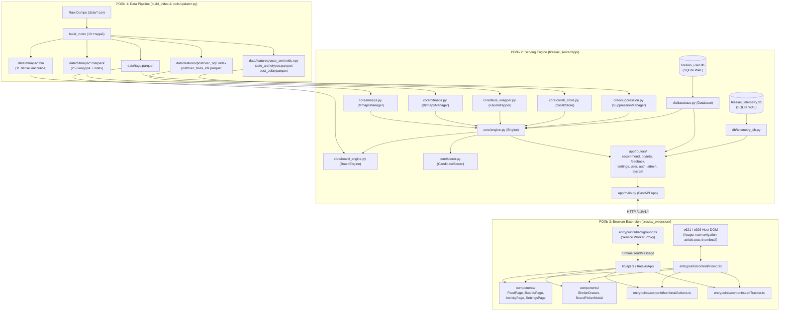
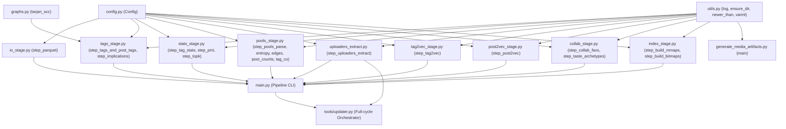
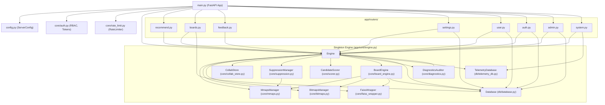
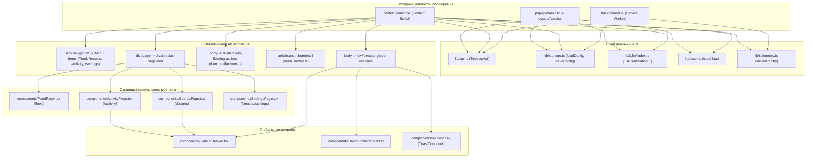

# Полный граф зависимостей и инженерный справочник Tiresias (Dependency Graph & Rulebook)

> **Назначение документа:** Карта взаимосвязей и зависимостей всех исполняемых файлов кодовой базы Tiresias во всех трёх ролях (`build_index`, `tiresias_server`, `tiresias_extension`).  
> Используется при внесении любых изменений в проект для предотвращения «обрезанных проводов» (рассинхронизации схем данных, вызовов к несуществующим методам, невалидных предположений о форматах файлов).

---

## 1. Сквозная системная топология (End-to-End System Graph)



---

## 2. РОЛЬ 1: Data Pipeline (`build_index/` + `tools/updater.py`)

### 2.1. Иерархия модулей конвейера данных



### 2.2. Паспорт модулей: Входы, Выходы и Форматы

| Файл модуля | Что импортирует | Входные данные (Читает) | Выходные данные (Пишет/Создаёт) | Ключевые структуры данных и типы |
|---|---|---|---|---|
| **`config.py`** | `os, pathlib, dataclasses` | Переменные окружения (`TIRESIAS_*`) | Конфигурационный объект `Config` | Гиперпараметры: `tag_shards=256`, `dim=128`, `category_weights`, пути к `data/` |
| **`utils.py`** | `datetime, pathlib` | — | Логи, байты varint | 7-bit LEB128 varint & delta encoding для `topkpack` |
| **`graphs.py`** | `typing` | Списки смежности графа | Компоненты сильной связности | Итеративный алгоритм Тарьяна без рекурсии ($O(V+E)$) |
| **`io_stage.py`** | `duckdb, polars, config, utils` | `data/posts.csv` | `data/posts_parquet/**/*.parquet` | Партиционирование Hive по `(rating, year, month)`, компрессия ZSTD |
| **`tags_stage.py`** | `polars, duckdb, pyarrow, graphs` | `tags.csv`, `tag_aliases.csv`, `tag_implications.csv`, `posts_parquet` | `tags_dict.parquet`, `post_tags_parquet/tag_shard=*`, `tag_implications.parquet`, `tag_ancestors_cache.parquet` | Шардирование по `tag_id % 256`; сжатие циклов синонимов через SCC |
| **`stats_stage.py`** | `polars, numpy, scipy.sparse` | `tags_dict.parquet`, `posts_parquet`, `post_tags_parquet` | `data/tags.parquet`, `data/tag_pmi.parquet`, `data/topk/shard_*.topkpack`, `data/topk/index_*.bin` | IDF сглаживание: $\ln((N+\alpha)/(DF+\alpha))$; PPMI разреженная матрица; struct `<iqi` |
| **`pools_stage.py`** | `polars, numpy` | `pools.csv`, `post_tags_parquet`, `data/mmaps/post_ids.bin` | `pools_meta.parquet`, `pools_parquet/`, `pool_entropy.parquet`, `pool_edges.parquet`, `tag_co_from_pools.parquet`, `mmaps/post_in_pools_count.bin` | Энтропия Шеннона $H = -\sum p \ln p$; веса ребер $1/\sqrt{\|pool\|}$; mmap выровнен по `post_ids.bin` |
| **`uploaders_extract.py`** | `duckdb, polars` | `posts_parquet` или `posts.csv` | `data/uploaders_uploads.csv` | `[user_id: Int64, upload_count: Int64, uploads: Utf8 "{id,id,...}"]` |
| **`tag2vec_stage.py`** | `scipy.sparse, faiss, numpy, polars` | `tags.parquet`, `tag_pmi.parquet`, `tag_co_from_pools.parquet` | `features/tag2vec.parquet`, `features/tag2vec_knn.parquet`, `features/tag2vec_meta.json` | Truncated randomized SVD над PPMI ($D=128$), L2 нормализация; FAISS IndexFlatIP |
| **`post2vec_stage.py`** | `faiss, polars, numpy, pyarrow` | `features/tag2vec.parquet`, `tags.parquet`, `posts_parquet`, `post_tags_parquet` | `features/post2vec.parquet`, `features/post2vec_faiss_ids.parquet`, `features/post2vec_sq8.index`, `features/post2vec_faiss.index` | Вектор поста: $\sum w_{cat} \cdot IDF \cdot e_t$; FAISS IndexScalarQuantizer QT_8bit |
| **`collab_stage.py`** | `faiss, sklearn, polars, numpy` | `user_favorites.csv`, `features/post2vec.parquet`, `features/post2vec_sq8.index` | `features/post_cofav.parquet`, `features/taste_centroids.npy`, `features/taste_archetypes.parquet` | Co-fav матрица $M^T M$; Spherical MiniBatchKMeans ($K=64$ на сфере $\mathbb{S}^{127}$) |
| **`index_stage.py`** | `polars, numpy, pyroaring` | `posts_parquet`, `post_tags_parquet` | **`data/mmaps/*.bin`** (10 файлов), **`data/mmaps/*.roar`** (6 файлов), **`data/bitmaps/shard_*.roarpack`**, **`data/bitmaps/index_*.bin`** | **Формирование Канонической Биекции** $\pi(\text{post\_id}) \to \text{dense\_idx}$; 256 Roaring-шардов |
| **`generate_media_artifacts.py`** | `polars, numpy, pyroaring` | `posts_parquet`, `mmaps/post_ids.bin` | `mmaps/file_ext.bin`, `not_deleted.roar`, `media_image.roar`, `media_video.roar` | Верификация совпадения порядка с `post_ids.bin`; генерация масок |
| **`main.py`** | Все модули `build_index` | Аргументы командной строки | Исполнение стадий по DAG | Проверка предусловий артефактов `validate_step_dependencies` |
| **`tools/updater.py`** | `subprocess, duckdb, shutil` | `data/` сырые файлы | Оркестрация бэкапа, сборки и деплоя | Взаимодействие с `/api/v1/system/*` (maintenance, reload) |

---

### 2.3. Матрица каскадной инвалидации артефактов

Если модифицируется или перезапускается стадия в левой колонке, **все перечисленные зависимые стадии становятся невалидными** и требуют обязательного перезапуска:

```
[parquet] ───> [tags / post_tags] ───> [stats] ───> [tag2vec] ───> [post2vec] ───> [taste_archetypes]
    │                 │                   │                          │
    └──> [mmaps] ─────┼─────────> [bitmaps]                          └──> [collab_favs]
           │          │
           └──> [pools_post_counts]
```

| Изменённая стадия | Что обязательно пересобрать следом | Почему ломается без пересборки |
|---|---|---|
| **`io_stage.py` (`parquet`)** | `tags`, `post_tags`, `mmaps`, `bitmaps`, `stats`, `topk`, `pools_*`, `tag2vec`, `post2vec`, `taste_archetypes` | Меняется пул постов, даты, метаданные и партиции Parquet. |
| **`index_stage.py` (`mmaps`)** | **`bitmaps`**, **`pools_post_counts`**, **`generate_media_artifacts`** | **КРИТИЧНО:** `post_ids.bin` задаёт каноническую биекцию. Любое изменение порядка или состава постов превращает существующие Roaring Bitmaps в мусор (указывают на чужие строки). |
| **`tags_stage.py` (`tags/post_tags`)** | `bitmaps`, `stats`, `topk`, `pools_entropy`, `pmi`, `tag2vec`, `post2vec` | Смещаются `tag_id`, меняются связи пост-тег и шарды `tag_shard=*`. |
| **`stats_stage.py` (`stats`)** | `tag2vec`, `post2vec`, `taste_archetypes` | Меняются значения IDF тегов, используемые при взвешивании эмбеддингов постов. |
| **`tag2vec_stage.py` (`tag2vec`)** | `post2vec`, `taste_archetypes` | Изменяется 128-мерное пространство векторов тегов $E$. |
| **`post2vec_stage.py` (`post2vec`)** | `taste_archetypes` | Изменяется индекс FAISS SQ8 и векторы постов, на основе которых строятся центроиды вкусов. |
| **`pools_stage.py` (`pools_parse`)** | `pools_entropy`, `pools_edges`, `pools_post_counts`, `pools_tag_co`, `tag2vec` | Меняется членство постов в пулах. |

---

## 3. РОЛЬ 2: Сервер и Базы Данных (`tiresias_server/app/`)

### 3.1. Архитектура связей и владения объектами ядра



### 3.2. Матрица привязки роутеров к внутренним модулям и эндпоинтам

| Роутер (`app/routers/`) | Эндпоинты пути | Вызываемые методы Engine / DB | Используемые Pydantic Schemas | Уровень доступа (RBAC) |
|---|---|---|---|---|
| **`recommend.py`** | `POST/GET /api/v1/recommend/feed`<br/>`POST/GET /api/v1/recommend/similar` | `Engine.recommend_feed()`<br/>`Engine.recommend_similar()` | `FeedRequest`, `FeedResponse`, `SimilarRequest`, `SimilarResponse` | Public / Optional Token |
| **`boards.py`** | `POST/GET /api/v1/boards`<br/>`GET/PATCH/DELETE /api/v1/boards/{id}`<br/>`POST/DELETE /api/v1/boards/{id}/posts`<br/>`POST/GET /api/v1/boards/{id}/recommend`<br/>`GET /api/v1/boards/{id}/export`<br/>`POST /api/v1/boards/import` | `Database.create_board()`<br/>`Database.list_user_boards()`<br/>`BoardEngine.get_hydrated_board_posts()`<br/>`BoardEngine.extract_salient_tags()`<br/>`BoardEngine.recommend_for_board()`<br/>`Database.add_posts_to_board()` | `BoardCreateRequest`, `BoardSummary`, `BoardDetailResponse`, `BoardPostsAddRequest`, `BoardRecommendRequest`, `BoardExportResponse` | Owner / Public (для публичных досок) |
| **`feedback.py`** | `POST /api/v1/feedback`<br/>`POST /api/v1/feedback/seen` | `Engine.record_feedback()`<br/>`Engine.remove_feedback()`<br/>`Database.record_seen_batch()` | `FeedbackRequest`, `FeedbackResponse`, `SeenBatchRequest`, `SeenBatchResponse` | Public |
| **`settings.py`** | `GET/PUT/DELETE /api/v1/settings/tag_blacklist`<br/>`GET/PUT /api/v1/settings/preferences` | `Database.get_user_tag_blacklist()`<br/>`Database.add_tag_blacklist()`<br/>`Database.set_user_settings()` | `TagBlacklistRequest`, `TagBlacklistResponse`, `PreferencesRequest`, `PreferencesResponse` | Public |
| **`user.py`** | `POST /api/v1/user/reset`<br/>`POST /api/v1/user/archetype/override`<br/>`GET /api/v1/user/{id}/profile`<br/>`GET /api/v1/user/{id}/feedback` | `Database.reset_user_history()`<br/>`Database.set_user_archetype_override()`<br/>`Database.get_user_profile_stats()`<br/>`Database.get_user_feedback_history()` | `UserResetRequest`, `UserResetResponse`, `ArchetypeOverrideRequest`, `ArchetypeOverrideResponse` | Owner / TESTER / ADMIN |
| **`auth.py`** | `POST /api/v1/auth/session-handshake`<br/>`POST /api/v1/auth/register`<br/>`POST /api/v1/auth/login`<br/>`POST /api/v1/auth/logout`<br/>`GET /api/v1/auth/me`<br/>`POST /api/v1/auth/password`<br/>`GET/POST/DELETE /api/v1/auth/sandbox*` | `Database.create_or_get_e621_user()`<br/>`Database.register_local_user()`<br/>`Database.authenticate_local_user()`<br/>`Database.create_sandbox_profile()` | `SessionHandshakeRequest`, `LocalRegisterRequest`, `LocalLoginRequest`, `AuthUserResponse`, `SetPasswordRequest` | Rate-limited (15 req/min) / Authenticated |
| **`admin.py`** | `GET/POST/DELETE /api/v1/admin/users*`<br/>`GET/POST/DELETE /api/v1/admin/invites*`<br/>`GET /api/v1/admin/system/stats`<br/>`POST /api/v1/admin/system/maintenance`<br/>`POST /api/v1/admin/system/reload-artifacts` | `Database.list_users()`, `set_user_role()`<br/>`Database.add_invited_user()`<br/>`Engine.set_maintenance_mode()`<br/>`Engine.reload_artifacts()` | `AdminUserListResponse`, `AdminRoleUpdateRequest`, `AdminInviteCreateRequest`, `SystemStatsResponse` | ADMIN (Role 100) / Master Key |
| **`system.py`** | `GET /api/v1/system/health`<br/>`GET/POST /api/v1/system/diagnostics*`<br/>`POST/GET/DELETE /api/v1/system/client-errors*`<br/>`POST /api/v1/system/suppression/reload`<br/>`POST /api/v1/system/reload-artifacts`<br/>`GET /api/v1/system/archetypes*` | `Engine.get_status()`<br/>`Engine.run_diagnostics()`<br/>`TelemetryDatabase.record_error()`<br/>`SuppressionManager.reload()`<br/>`Engine.reload_artifacts()` | `HealthResponse`, `ClientErrorCreate`, `ClientErrorsResponse` | Public (чтение) / ADMIN (модификация) |

---

### 3.3. Карта взаимодействия при Hot Reload (`Engine.reload_artifacts()`)

Когда срабатывает `/api/v1/system/reload-artifacts`:
1. Блокируется `Engine._reload_lock` (`threading.Lock`).
2. Резолвится целевой `data_root` (с поддержкой симлинков `data_current` или `current`).
3. Создаются свежие экземпляры:
   - `new_mmaps = MmapsManager(new_dir)`
   - `new_bitmaps = BitmapsManager(new_dir)`
   - `new_faiss = FaissWrapper(new_faiss_path)`
   - `new_collab = CollabStore(...)`
   - `new_suppression = SuppressionManager(...)`
   - `new_popular = self._precompute_popular_by_rating(...)`
4. Закрываются старые дескрипторы: `old_mmaps.close()`.
5. Переключаются ссылки в `self` (`Engine`).
6. **ОБЯЗАТЕЛЬНО обновляются ссылки в `self.boards` (`BoardEngine`):**
   - `self.boards.mmaps = self.mmaps`
   - `self.boards.faiss = self.faiss`
   - `self.boards.bitmaps = self.bitmaps`
7. Перезапускается диагностический аудит `self.run_diagnostics()`.
8. Замок освобождается.

---

## 4. РОЛЬ 3: Браузерное расширение (`tiresias_extension/`)

### 4.1. Дерево компонентов Preact и точки входа



### 4.2. Шина событий `tiresias:*` (Event Bus)

Связывает независимые компоненты через `window.dispatchEvent` / `addEventListener`:

| Имя события | Кто отправляет (`dispatchEvent`) | Кто слушает (`addEventListener`) | Данные в `e.detail` | Назначение |
|---|---|---|---|---|
| **`tiresias:show-similar`** | `thumbnailActions.ts` (клик ✨) | `content/index.tsx` (`GlobalOverlays`) | `{ postId: number }` | Открывает сайдбар `SimilarDrawer` для поиска визуально похожих артов |
| **`tiresias:show-board-picker`**| `thumbnailActions.ts` (клик 📁) | `content/index.tsx` (`GlobalOverlays`) | `{ post: PostMetadata }` | Открывает модалку `BoardPickerModal` для сохранения арта в доску |
| **`tiresias:remove-from-board`**| `thumbnailActions.ts` (клик ✕) | `BoardsPage.tsx` | `{ postId: number, boardId: string }`| Удаляет пост из текущей открытой доски |
| **`tiresias:add-to-current-board`**| `thumbnailActions.ts` (клик ➕)| `BoardsPage.tsx` | `{ postId: number, boardId: string }`| Добавляет пост из блока рекомендаций в открытую доску |
| **`tiresias:board-updated`** | `BoardPickerModal.tsx` | `BoardsPage.tsx` | `{ boardId: string, postId: number }` | Сигнализирует о создании доски или добавлении поста, заставляя `BoardsPage` обновиться |
| **`tiresias:view_settings_changed`**| `FeedPage.tsx` | `BoardsPage.tsx`, `SimilarDrawer.tsx` | `{ contain?: bool, cardSize?: int, showDesc?: bool }` | Синхронизирует размер карточек и режим отображения (Crop/Fit) между вкладками |
| **`tiresias:language-changed`** | `lib/i18n/index.ts` | `useTranslation`, `content/index.tsx`, `thumbnailActions.ts` | `{ language: 'ru' \| 'en' }` | Мгновенно переключает тексты кнопок, тултипов и меню без перезагрузки |
| **`tiresias:toast`** | `lib/toast.ts` | `components/ui/Toast.tsx` (`ToastContainer`) | `{ id, type, message, duration }` | Отображает всплывающее уведомление (успех, ошибка, инфо) |
| **`tiresias:toast-dismiss`** | `lib/toast.ts` | `components/ui/Toast.tsx` (`ToastContainer`) | `{ id: string }` | Закрывает уведомление по таймеру или клику |

### 4.3. Хранилище настроек (`browser.storage.local` и `localStorage`)

| Ключ | Где хранится | Тип данных | Назначение и подписчики |
|---|---|---|---|
| **`tiresias_settings`** | `browser.storage.local` + `localStorage` | Объект `ServerConfig` | Главный конфиг расширения (`serverUrl`, `userId`, `authToken`, `language`, `testerMode`, `autoSeen`). Изменения в попапе мгновенно ловятся контент-скриптом через `chrome.storage.onChanged`. |
| **`e6.posts.contain`** | `localStorage` | `'true' \| 'false'` | Режим подгонки превью в карточках (contain vs cover). Читается `FeedPage`, `BoardsPage`, `SimilarDrawer`. |
| **`e6.posts.custom_size`** | `localStorage` | `string` (`"110"`–`"340"`) | Ползунок размера карточек в пикселях. Задает CSS-переменную `--thumb-image-size`. |
| **`e6.posts.show_desc`** | `localStorage` | `'true' \| 'false'` | Видимость подвала карточки (счет, рейтинг, избранное). |
| **`tiresias_cache_boards_${userId}`** | `localStorage` | JSON `Board[]` | Офлайн-кэш списка досок пользователя на случай недоступности сервера. |
| **`tiresias_cache_board_${boardId}`** | `localStorage` | JSON `BoardDetail` | Офлайн-кэш конкретной доски с постами. |

---

## 5. Сквозная матрица перекрёстного влияния (Cross-Role Impact Matrix)

Таблица отвечает на вопрос: **«Если я меняю файл в роли X, какие файлы в других ролях я ОБЯЗАН проверить/изменить?»**

| Изменяемый файл / сущность | Где находится | Что ломается в других ролях при несогласованности | Затронутые файлы в других ролях |
|---|---|---|---|
| **`posts.csv` / парсинг колонок** | `build_index/io_stage.py` | Если добавлена/удалена колонка в `posts_parquet`, ломаются TF-IDF в `BoardEngine` и mmap-экстрактор. | `build_index/index_stage.py`<br/>`tiresias_server/app/core/board_engine.py` |
| **`index_stage.py` (`step_build_mmaps`)** | `build_index/` | Изменение типов массивов или добавление бинарников требует добавления чтения в `MmapsManager` и выгрузки в deploy-скриптах. | `tiresias_server/app/core/mmaps.py`<br/>`tiresias_server/scripts/sync_data.py`<br/>`tools/updater.py` |
| **Коды расширений (`ext_code_map`)** | `build_index/index_stage.py` | Если изменить числовой код расширения (например, webm=4), сервер перестанет корректно определять видео/изображения. | `tiresias_server/app/core/mmaps.py` (строка 100)<br/>`tiresias_server/app/core/diagnostics.py` |
| **Pydantic-схемы API (`schemas/api.py`)** | `tiresias_server/app/` | Если изменить поля ответа (`FeedResponse`, `BoardSummary`), расширение упадет при парсинге или перестанет рендерить данные. | `tiresias_extension/src/lib/types.ts`<br/>`tiresias_extension/src/lib/api.ts`<br/>`tiresias_extension/src/components/*` |
| **Роуты эндпоинтов (`routers/*.py`)** | `tiresias_server/app/` | Изменение пути URL приводит к ошибкам 404 в фоновом прокси расширения. | `tiresias_extension/src/lib/api.ts` |
| **Схема БД `tiresias_user.db`** | `tiresias_server/app/db/` | Новые поля требуют обновления как миграций в `_init_schema()`, так и DTO-моделей в `schemas/api.py` и `schemas/admin.py`. | `tiresias_server/app/schemas/`<br/>`tiresias_server/app/cli.py` |
| **Селекторы карточек в DOM** | `tiresias_extension/` | Если в `FeedPage.tsx` или `BoardsPage.tsx` убрать класс `.tiresias-card-item` или атрибут `data-id`, перестанут работать плавающая панель действий и трекер просмотров. | `tiresias_extension/src/entrypoints/content/thumbnailActions.ts`<br/>`tiresias_extension/src/entrypoints/content/seenTracker.ts` |
| **Тексты интерфейса расширения** | `tiresias_extension/` | Добавление ключа без обновления `ru.ts` и `en.ts` роняет сборку TypeScript (`tsc`). | `tiresias_extension/src/lib/i18n/locales/ru.ts`<br/>`tiresias_extension/src/lib/i18n/locales/en.ts` |

---

## 6. Золотые правила разработчика (The Rulebook: "Read X Before Modifying Y")

### 🔹 Правило 1: Инвариант Канонической Биекции (The Bijection Rule)
> **Перед изменением `build_index/index_stage.py` вы ОБЯЗАНЫ прочитать `tiresias_server/app/core/mmaps.py` и `index_stage.py` (`step_build_bitmaps`).**  
> Сортировка по `id ASC` в `step_build_mmaps` является фундаментальным инвариантом всей системы. Dense-индекс $i \in [0, N-1]$ жестко зашит во все Roaring Bitmaps. Любое нарушение сортировки или фильтрация массива `post_ids.bin` делает невалидными все битмапы цензуры, тегов и медиафайлов.

### 🔹 Правило 2: Правило Двоичных Структур (Binary Struct Layout Rule)
> **Перед изменением `build_index/stats_stage.py` (`step_topk`) или `build_index/index_stage.py` (`step_build_bitmaps`) вы ОБЯЗАНЫ проверить формат struct packing.**  
> Файлы `index_*.bin` строго упакованы в 16-байтовую структуру `<iqi` (`tag_id: int32`, `offset: int64`, `length: int32`). Изменение разрядности или добавление полей разрушит бинарный поиск смещений.

### 🔹 Правило 3: Синхронизация Артефактов с Деплоем (Production Manifest Rule)
> **Если вы добавляете новый файл в `data/mmaps/` или `data/features/`, вы ОБЯЗАНЫ зарегистрировать его в `tiresias_server/scripts/sync_data.py` (`SERVING_ARTIFACTS`) и `tools/updater.py`.**  
> Деплой-скрипты передают на сервер только те файлы, которые явно указаны в манифесте `SERVING_ARTIFACTS`. Если файл не зарегистрирован, сервер на продакшене/ноутбуке запустится со старыми данными или выбросит ошибку.

### 🔹 Правило 4: Изоляция Сети и Обход CSP (Content Script Network Rule)
> **В коде контент-скрипта (`tiresias_extension/src/entrypoints/content/*` и компонентах страниц) СТРОГО ЗАПРЕЩЕНО вызывать `window.fetch()` к серверу напрямую.**  
> Сайты `e926.net` и `e621.net` работают по HTTPS и имеют строгую политику CSP (`connect-src 'self'`). Любой прямой запрос на `http://127.0.0.1:8000` будет немедленно заблокирован браузером как Mixed Content. Все вызовы должны идти строго через `TiresiasApi` $\to$ `runtime.sendMessage` $\to$ `background.ts`.

### 🔹 Правило 5: Неприкосновенность Host DOM (Host DOM Isolation Rule)
> **Контент-скрипт расширения имеет право модифицировать контейнер `#page` ТОЛЬКО в том случае, если текущий URL совпадает с виртуальным роутом (`/feed`, `/boards`, `/activity`, `/tiresias/*`).**  
> На обычных страницах поиска (`/posts`, `/artists`, `/wiki`) контейнер `#page` трогать запрещено. На них разрешено только добавление кнопок в меню навигации, плавающей панели действий на превью и трекера просмотров.

### 🔹 Правило 6: Инвариант Закрытия Дескрипторов Windows (Windows Handle Leak Rule)
> **Если вы добавляете массив `np.memmap` в `MmapsManager`, вы ОБЯЗАНЫ добавить его имя в список `attrs` метода `close()` в `tiresias_server/app/core/mmaps.py`.**  
> В операционной системе Windows открытый дескриптор `_mmap` блокирует файл на диске. Если метод `close()` не закроет mmap явно, скрипты обновления (`updater.py`) упадут с `PermissionError: [WinError 32]` при попытке перезаписать артефакты.

### 🔹 Правило 7: Синхронизация Моделей Данных Client-Server (Pydantic / TypeScript Sync Rule)
> **При изменении любого эндпоинта в `tiresias_server/app/routers/` вы ОБЯЗАНЫ одновременно обновить схему в `schemas/api.py`, интерфейс в `tiresias_extension/src/lib/types.ts` и метод в `src/lib/api.ts`.**  
> Любое переименование полей (например `post_id` $\leftrightarrow$ `id`) без обновления TypeScript интерфейсов приводит к тихим ошибкам в UI, когда свойства отображаются как `undefined`.

---

## 7. Чек-лист проверки целостности связей перед коммитом

- [ ] **Data Pipeline:** Команда `python -m build_index.main --do all` отрабатывает без ошибок, `post_ids.bin` строго отсортирован.
- [ ] **Manifest Sync:** Новые файлы артефактов зарегистрированы в `SERVING_ARTIFACTS` скрипта `sync_data.py`.
- [ ] **Server Diagnostics:** Запрос `GET /api/v1/system/diagnostics` возвращает `"status": "healthy"` с нулем предупреждений.
- [ ] **Mmap Handles:** Метод `Engine.reload_artifacts()` успешно перечитывает файлы без блокировок процессов.
- [ ] **TypeScript Types:** Запуск `npm run compile` (`tsc --noEmit`) в `tiresias_extension` завершается с кодом 0.
- [ ] **i18n Completeness:** Все новые ключи присутствуют одновременно в `locales/ru.ts` и `locales/en.ts`.
- [ ] **DOM Selectors:** Карточки в расширении содержат селекторы `.tiresias-card-item` и атрибут `data-id`.
