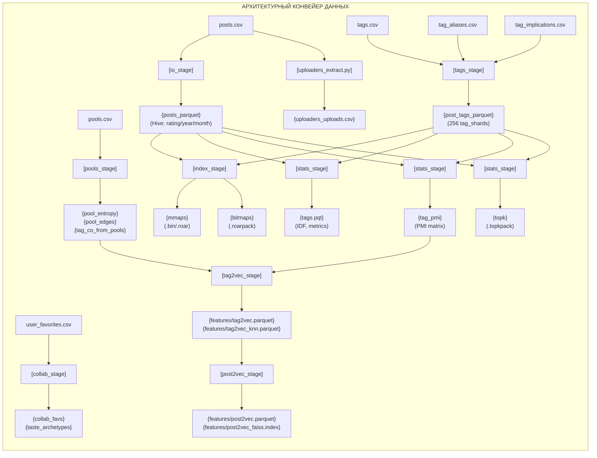

# Архитектурное руководство проекта TIRESIAS

## 1. Введение и Архитектурный Обзор

**TIRESIAS** представляет собой распределенный программно-аппаратный комплекс офлайн-индексации, векторного поиска и обслуживания персональных рекомендаций для крупномасштабных мультимодальных каталогов изображений Booru-архитектуры (на данный момент только e621/e926). Система компенсирует отсутствие серверной персонализации на стороне целевой платформы методом внешнего наложения (client-side overlay) и функционирует в условиях жестких внешних ограничений: нулевого доступа к закрытым базам данных сайта, лимитов публичного REST API и недопустимости локального хранения терабайтных медиа-архивов.

Архитектура построена на трёх взаимосвязанных уровнях:
1. **Аналитический конвейер подготовки данных (`build_index`):** переводит неструктурированные дампы каталога в компактные бинарные артефакты. Включает нормализацию таксономии тегов с разрешением циклических коллизий в ацикличные графы (DAG) алгоритмом Тарьяна, информационную фильтрацию пулов по энтропии Шеннона, расчет матриц совместной встречаемости PPMI и понижение размерности через Truncated SVD (ранг $D=128$, L2-нормализация). Векторы публикаций синтезируются через батчевое матричное умножение взвешенных категориальных IDF-весов тегов и квантуются в 8-битный скалярный индекс **FAISS SQ8**, обеспечивая сжатие векторного пространства до $\approx 720$ МБ. Подробности описаны в связанной с конвейером документации.
2. **Serving-микросервис обслуживания (`tiresias_server`):** высокопроизводительный асинхронный REST API на FastAPI/Uvicorn с задержкой ответа <5 мс. Реализует zero-copy доступ к плотным бинарным метаданным постов через системный `mmap`, микросекундную булеву фильтрацию цензурных категорий и тегов через битовые карты **Roaring Bitmaps**, расчет центроидов тематических досок $\vec{c}_B$, многофакторный скоринг с экспоненциальным затуханием просмотренного контента (`seen decay`) и коллаборативную фильтрацию на базе 64 кластерных архетипов вкуса. Сервер изолирован от модификаций глобальных данных, потребляет $\le 1.5$ ГБ RAM и аппаратно оптимизирован для работы на низкопроизводительных хостах.
3. **Клиентский уровень интеграции (`tiresias_extension`):** расширение для браузеров (Manifest V3, WXT, Preact), выполняющее внедрение реактивного интерфейса непосредственно в DOM-дерево сайтов (на данный момент только e621/e926). Обеспечивает бесшовную синхронизацию сессии пользователя, сбор неявной и явной обратной связи (лайки, скрытия, реакции), локальное кэширование коллекций и рендеринг бесконечной ленты рекомендаций.

---

### Конвейер данных офлайн-подготовки (`build_index`)
Цель офлайн-конвейера — преобразовать неструктурированные текстовые дампы (CSV) в комплекс компактных, векторизованных и индексированных структур данных, обеспечивающих:
1. Полнотекстовый и фасетный булев поиск по комбинациям тегов с задержкой $< 5$ мс на холодном старте.
2. Мгновенную фильтрацию по метаданным (рейтинги цензуры, разрешение, дата, популярность) без обращения к реляционным СУБД.
3. Семантический векторный поиск похожих тегов (Tag2Vec) и похожих публикаций (Post2Vec) через косинусное сходство в индексах FAISS.
4. Отдачу предрассчитанных топов популярного контента (Top-K) с нулевыми накладными расходами на сортировку.



---

## 2. Форматы хранения данных и структура репозитория

### 2.1. Исходные данные (`/data`)
- `posts.csv`: Основной дамп публикаций (~5 ГБ, 6 млн строк).
- `tags.csv`: Каталог тегов с категориями (художник, персонаж, копирайт, вид и т.д.) и счетчиками использования.
- `tag_aliases.csv`: Направленный граф синонимов тегов ($A \to B$).
- `tag_implications.csv`: Направленный граф иерархических импликаций тегов ($A \implies B$).
- `pools.csv`: Тематические серии, комиксы и пользовательские подборки.
- `user_favorites.csv`: Данные пользовательских взаимодействий.

### 2.2. Промежуточные и целевые структуры данных
```text
data/
 ├─ posts_parquet/                 # Hive-партиционированный Parquet (rating/year/month, ZSTD)
 ├─ post_tags_parquet/             # Шардированные пары (post_id, tag_id) (256 шардов)
 ├─ tags_dict.parquet              # Словарь активных тегов, присутствующих в индексе
 ├─ tags.parquet                   # Расширенный словарь с метриками IDF, avg_score, avg_fav
 ├─ tag_implications.parquet       # Бесконтурный ориентированный граф (DAG) импликаций
 ├─ tag_ancestors_cache.parquet    # Транзитивный кэш предков на глубину 3 для топ-5% тегов
 ├─ pool_entropy.parquet           # Оценки энтропии Шеннона для отсева зашумленных пулов
 ├─ pool_edges.parquet             # Взвешенный граф схожести постов на основе общих пулов
 ├─ tag_co_from_pools.parquet      # Со-встречаемость тегов из модерируемых пулов
 ├─ tag_pmi.parquet                # Разреженная матрица PMI между тегами
 ├─ bitmaps/                       # Инвертированный индекс Roaring Bitmap
 │   ├─ shard_0000.roarpack        # Пакеты сериализованных битовых карт
 │   └─ index_0000.bin             # Заголовки прямого доступа <iqi (tag_id, offset, length)
 ├─ topk/                          # Упакованные списки популярности Top-K
 │   ├─ shard_0000.topkpack        # Бинарные потоки сжатия D-gap + Varint (LEB128)
 │   └─ index_0000.bin             # Индекс прямого доступа к Top-K спискам
 ├─ uploaders_uploads.csv          # Сгенерированный дамп загрузок (артефакт uploaders_extract.py)
 ├─ mmaps/                         # Непрерывные бинарные массивы для zero-copy mmap
 │   ├─ post_ids.bin               # int64 первичные ключи, отсортированные по возрастанию
 │   ├─ score.bin, fav_count.bin   # int32 метрики популярности
 │   ├─ w.bin, h.bin, epoch_day.bin# int32 габариты и даты публикации
 │   ├─ is_deleted.bin, is_pending.bin # uint8 маски состояния
 │   ├─ rating.bin, file_ext.bin   # uint8 численные коды рейтингов и расширений файлов
 │   ├─ post_in_pools_count.bin    # int32 счетчик участия поста в пулах
 │   ├─ rating_{s,q,e}.roar        # Битовые маски цензурных категорий (Roaring Bitmaps)
 │   ├─ media_{image,video}.roar   # Битовые маски типов медиа (статика / анимация и видео)
 │   └─ not_deleted.roar           # Битовая маска неудаленных активных постов
 └─ features/                      # Машинное обучение и эмбеддинги
     ├─ tag2vec.parquet            # 128-мерные L2-нормализованные векторы тегов
     ├─ tag2vec_knn.parquet        # Таблица k-NN графа сходства тегов (опционально)
     ├─ tag2vec_meta.json          # Метаданные обучения (сингулярный спектр SVD)
     ├─ post2vec.parquet           # 128-мерные векторы постов (IDF-взвешенные суммы тегов)
     ├─ post2vec_faiss.index       # Индекс FAISS IndexFlatIP для векторного поиска постов
     ├─ post2vec_faiss_ids.parquet # Отображение внутренних строк FAISS на глобальные post_id
     ├─ post2vec_sq8.index         # Квантованный SQ8 индекс FAISS
     ├─ taste_centroids.npy        # Центроиды вкусовых кластеров
     ├─ taste_archetypes.parquet   # Вкусовые архетипы пользователей
     └─ post_cofav.parquet         # Граф совместных добавлений в избранное
```

---

## 3. Математические модели и алгоритмы

### 3.1. Разрешение циклов и иерархий (Алгоритм Тарьяна)
Связи синонимов и таксономии содержат человеческие ошибки в виде циклических зависимостей ($A \to B \to A$).
- В `tags_stage.py` алгоритм Тарьяна (`graphs.py`) находит компоненты сильной связности за $O(|V| + |E|)$.
- Для алиасов цикл схлопывается в один канонический тег с наивысшим $\mathrm{post\_count}$.
- Для импликаций ребра внутри компонент удаляются, гарантируя превращение графа в DAG (Directed Acyclic Graph).

### 3.2. Фильтрация пулов через информационную энтропию
Для фильтрации случайных закладок от сюжетных серий вычисляется шенноновская энтропия распределения вероятностей тегов внутри пула:
$$H_{\mathrm{tags}} = -\sum_{t \in \mathrm{Pool}} p(t) \ln p(t), \quad p(t) = \frac{\mathrm{cnt}(t)}{\sum \mathrm{cnt}}$$
а также $H_{\mathrm{idf}}$ со сглаживанием редких признаков. Коллекции с $H > 6.0$ отсекаются.

### 3.3. Статистика ассоциаций (PMI)
Совместная встречаемость вычисляется через разреженное матричное умножение $C = X^T X$ на отфильтрованном подмножестве 16 наименее частых тегов на публикацию:
$$\mathrm{PMI}(a, b) = \ln \left(\frac{P(a, b) + \varepsilon}{P(a)P(b) + \varepsilon}\right)$$

### 3.4. Спектральные эмбеддинги Tag2Vec (PPMI + Truncated SVD)
Графы PMI и пулов объединяются: $W = W_{\mathrm{pmi}} + \alpha W_{\mathrm{pools}}$. Строится матрица Shifted PPMI:
$$X_{ij} = \max\left(0, \ln \frac{W_{ij} S}{d_i d_j} - \text{shift}\right)$$
Через усеченное сингулярное разложение ранга $D=128$ ($X \approx U \Sigma U^T$) строятся эмбеддинги $E = U \Sigma^{1/2}$, которые затем построчно проецируются на единичную гиперсферу ($L_2$-нормализация).

### 3.5. Агрегация векторов постов (Post2Vec)
Вектор публикации синтезируется как единичный вектор взвешенной суммы признаков:
$$v_p = \frac{\sum_{t \in T_p} \mathrm{IDF}(t) \cdot w_{\mathrm{cat}}(t) \cdot e_t}{\left\|\sum_{t \in T_p} \mathrm{IDF}(t) \cdot w_{\mathrm{cat}}(t) \cdot e_t\right\|_2}$$
Батчевое вычисление выполняется через умножение разреженной матрицы инцидентности на матрицу тегов: $X = M \times E_w$.

### 3.6. Сжатие списков Top-K (D-gaps + Varint / LEB128)
Идентификаторы лучших публикаций по тегам сортируются по возрастанию и преобразуются в разности $\Delta_i = x_i - x_{i-1}$, после чего кодируются 7-битным представлением переменной длины. Это обеспечивает 4–5-кратную компрессию без накладных расходов на распаковку общими компрессорами.

---

## 4. Конкурентная модель и оптимизация ресурсов
- **DuckDB**: Используется для первичной конвертации CSV $\to$ Parquet. Векторизованный многопоточный SQL-движок обходит GIL Python и исключает скачки памяти.
- **Polars**: Используется во всех аналитических шагах со streaming-движком (`collect(engine="streaming")`), что позволяет обрабатывать таблицы из 150 млн связей при потреблении RAM $< 4$ ГБ.
- **Scipy & BLAS**: Умножения разреженных матриц для PMI и Post2Vec транслируются в оптимизированные вызовы C/Fortran.
- **FAISS (Facebook AI)**: Индексы `IndexFlatIP` задействуют SIMD-инструкции (AVX2/AVX-512) и многопоточность OpenMP (`omp_set_num_threads`).
- **Zero-Copy Memory-Mapping**: Массивы `.bin` отображаются напрямую в адресное пространство операционной системы, разделяясь между всеми процессами чтения через OS Page Cache.

---

## 5. Валидация и Мониторинг качества (Autotests)
Пайплайн сопровождается специализированным набором интеграционных тестов:
- `autotest/autotest_index.py`: Полная верификация форматов Parquet, непересекаемости масок рейтингов, целостности упаковок Roaring Bitmap и Top-K, проверка контрольных сумм.
- `autotest/autotest_tag2vec.py`: Проверка семантических окрестностей тегов и k-NN графа.
- `autotest/autotest_post2vec.py`: Поэлементный контроль $L_2$-погрешности векторов постов против формулы IDF-агрегации и тест самопоиска FAISS.
- `autotest/test_collab.py`: Тестирование совместной фильтрации и расчета вкусовых архетипов.
- `autotest/test_bijection.py`: Проверка биективных соответствий внутренних идентификаторов.
- `autotest/test_graphs.py`: Модульное тестирование графовых алгоритмов (например, алгоритма Тарьяна).
- `autotest/visualize_post2vec_cpu.py`: 2D-проекция UMAP + кластеризация HDBSCAN с генерацией интерактивного HTML-дашборда на базе Bokeh и Datashader.
