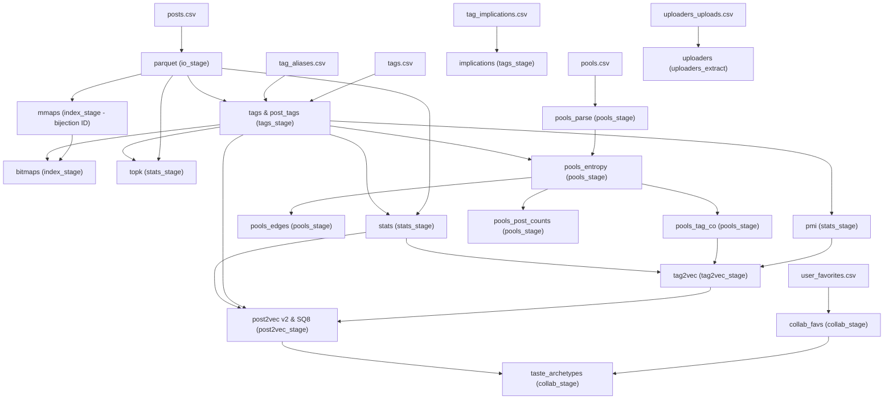

# Модуль `main.py` (Техническая документация)

## 1. Назначение и Архитектурная роль
Модуль `main.py` является точкой входа (Command Line Interface, CLI Orchestrator) для всего офлайн-пайплайна подготовки данных и генерации поисковых структур `TIRESIAS_ENGINE` / `build_index`.

Он выполняет следующие функции:
1. Парсинг параметров командной строки через `argparse.ArgumentParser`.
2. Конструирование и валидация объекта конфигурации `Config`.
3. Логирование манифеста параметров в формате JSON.
4. Последовательный вызов этапов конвейера (ETL, графовая обработка, статистический анализ, Roaring-индексация, обучение векторных представлений Tag2Vec и Post2Vec).

## 2. Граф зависимостей стадий (`--do`)

Пайплайн спроектирован по модульному принципу: каждый шаг можно запускать как в составе сквозного конвейера, так и изолированно при повторном эксперименте.



## 3. Поддерживаемые стадии и аргументы флага `--do`

| Аргумент в `--do` | Модуль и функция | Входные данные | Выходные артефакты |
| :--- | :--- | :--- | :--- |
| `parquet` | `io_stage.step_parquet` | `posts.csv` | `posts_parquet/` |
| `tags` / `post_tags` | `tags_stage.step_tags_and_post_tags` | `posts_parquet`, `tags.csv`, `tag_aliases.csv` | `post_tags_parquet/`, `tags_dict.parquet` |
| `implications` | `tags_stage.step_implications` | `tags.csv`, `tag_implications.csv` | `tag_implications.parquet`, `tag_ancestors_cache.parquet` |
| `mmaps` | `index_stage.step_build_mmaps` | `posts_parquet/` | `mmaps/*.bin` (устанавливает биекцию ID) |
| `bitmaps` | `index_stage.step_build_bitmaps` | `post_tags_parquet/`, `mmaps/post_ids.bin` | `bitmaps/*.roarpack`, `bitmaps/*.bin`, `bitmaps/ratings/` |
| `stats` | `stats_stage.step_tag_stats` | `posts_parquet`, `post_tags_parquet`, `tags_dict.parquet` | `tags.parquet` (IDF, avg metrics) |
| `topk` | `stats_stage.step_topk` | `posts_parquet`, `post_tags_parquet` | `topk/*.topkpack`, `topk/*.bin` (пошагово 256 шардов) |
| `pools_parse` | `pools_stage.step_pools_parse` | `pools.csv` | `pools_parquet/`, `pools_meta.parquet` |
| `pools_entropy` | `pools_stage.step_pools_entropy` | `pools_parquet`, `post_tags_parquet` | `pool_entropy.parquet` |
| `pools_edges` | `pools_stage.step_pool_edges` | `pools_parquet`, `pool_entropy.parquet` | `pool_edges.parquet` |
| `pools_post_counts` | `pools_stage.step_post_in_pools_count`| `pools_parquet`, `pool_entropy.parquet` | `mmaps/post_in_pools_count.bin` |
| `pools_tag_co` | `pools_stage.step_pool_tag_co` | `pools_parquet`, `pool_entropy.parquet`, `post_tags_parquet` | `tag_co_from_pools.parquet` |
| `pmi` | `stats_stage.step_pmi` | `post_tags_parquet`, `tags_dict.parquet` | `tag_pmi.parquet` (с отсечением редких тегов $<50$) |
| `uploaders` | `uploaders_extract.step_uploaders_extract` | `uploaders_uploads.csv` | `features/uploaders.parquet` |
| `tag2vec` | `tag2vec_stage.step_tag2vec` | `tag_pmi.parquet`, `tag_co_from_pools.parquet`, `tags.parquet` | `features/tag2vec.parquet`, `features/tag2vec_knn.parquet`, `meta.json` |
| `post2vec` | `post2vec_stage.step_post2vec` | `features/tag2vec.parquet`, `post_tags_parquet`, `tags.parquet` | `features/post2vec.parquet`, `features/post2vec_sq8.index`, `features/post2vec_faiss_ids.parquet` |
| `collab_favs` | `collab_stage.step_collab_favs` | `user_favorites.csv` | `features/post_cofav.parquet` (чанкованная проекция строк) |
| `taste_archetypes` | `collab_stage.step_taste_archetypes` | `user_favorites.csv`, `features/post2vec.parquet`, `features/post2vec_sq8.index` | `features/taste_centroids.npy`, `features/taste_archetypes.parquet` |

*Примечание: Псевдонимы `pools`, `tags` и `collab` в параметре `--do` расширяются в соответствующие наборы стадий.*


## 4. Запуск из терминала
Типовой вызов полного пайплайна (из скрипта `run_index.bat`):
```bash
python -m build_index.main \
    --root data \
    --do tags post_tags parquet stats pmi pools mmaps bitmaps topk pools_entropy pools_tag_co tag2vec post2vec \
    --workers 8 \
    --pool-min-size 3 \
    --pool-max-size 200 \
    --pools-collection-entropy-max 5.5 \
    --pmi-support 50 \
    --pmi-top-m-per-post 16 \
    --tag2vec-dim 128 \
    --tag2vec-min-df 200 \
    --tag2vec-source merge \
    --tag2vec-pool-alpha 0.5 \
    --tag2vec-knn-k 100
```
