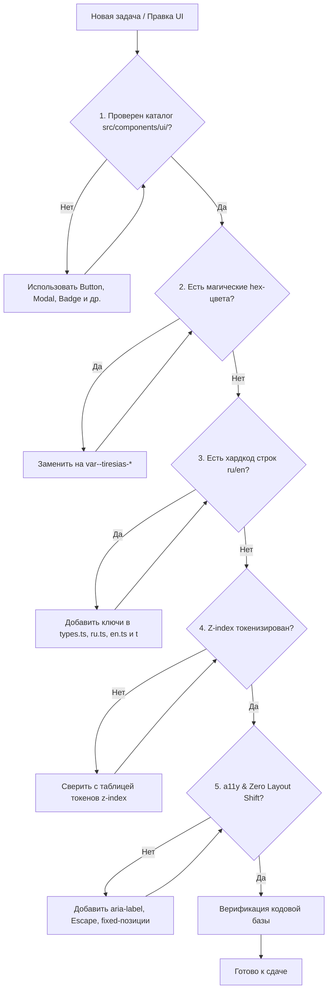

# Tiresias Browser Extension — Руководство по дизайн-системе и UI-архитектуре

> **Статус**: Production / Single Source of Truth  
> **Область действия**: Браузерное расширение Tiresias (`root/tiresias_extension`)  
> **Целевые платформы**: Chromium (Chrome MV3) и Firefox (Gecko MV3)  
> **Стек UI**: Preact (JSX/TSX), WXT Framework, CSS Custom Properties  
> **Версия дизайн-системы**: 1.0.0 (Stage 5 Architecture)

---

## Оглавление

1. [Философия UI/UX и принципы Single Source of Truth (SSOT)](#1-философия-uiux-и-принципы-single-source-of-truth-ssot)
2. [Справочник дизайн-токенов (`src/styles/theme.css`)](#2-справочник-дизайн-токенов-srcstylesthemecss)
   - [Поверхности и фоны](#21-поверхности-и-фоны)
   - [Типографика и цвета текста](#22-типографика-и-цвета-текста)
   - [Границы и разделители](#23-границы-и-разделители)
   - [Брендовые цвета и акценты](#24-брендовые-цвета-и-акценты)
   - [Семантические статусы](#25-семантические-статусы)
   - [Цвета рейтингов booru](#26-цвета-рейтингов-booru-e621-e926)
   - [Категории тегов booru](#27-категории-тегов-booru)
   - [Геометрия, радиусы, тени и переходы](#28-геометрия-радиусы-тени-и-переходы)
   - [Иерархия Z-index (Слои наложения)](#29-иерархия-z-index-слои-наложения)
3. [Каталог UI-компонентов (`src/components/ui/`)](#3-каталог-ui-компонентов-srccomponentsui)
   - [`toast` и `<ToastContainer />`](#31-система-уведомлений-toast-и-toastcontainer)
   - [`<Modal />`](#32-модальные-окна-modal)
   - [`<Drawer />`](#33-боковая-шторка-drawer)
   - [`<Button />` и `<IconButton />`](#34-кнопки-button-и-iconbutton)
   - [`<Input />`, `<Select />` и `<FormGroup />`](#35-элементы-форм-input-select-и-formgroup)
   - [`<Toggle />` и `<SegmentedControl />`](#36-переключатели-toggle-и-segmentedcontrol)
   - [`<Badge />` и `<StatusDot />`](#37-бейджи-и-статусы-badge-и-statusdot)
4. [Интернационализация и локализация (`src/lib/i18n/`)](#4-интернационализация-и-локализация-srclibi18n)
   - [Архитектура словарей](#41-архитектура-словарей)
   - [Правило синхронности словарей](#42-правило-синхронности-словарей)
   - [Использование хука `useTranslation()`](#43-использование-хука-usetranslation)
   - [Использование функции `t()` вне хуков](#44-использование-функции-t-вне-хуков)
   - [Межконтекстная синхронизация языка](#45-межконтекстная-синхронизация-языка)
5. [Чеклист перед внесением изменений в UI (Правила для людей и нейросетей)](#5-чеклист-перед-внесением-изменений-в-ui-правила-для-людей-и-нейросетей)

---

## 1. Философия UI/UX и принципы Single Source of Truth (SSOT)

Дизайн-система браузерного расширения Tiresias решает ключевую задачу: обеспечить единообразный, легко расширяемый, визуально гармоничный и надежный пользовательский интерфейс как внутри инжектируемых страниц booru (e926 / e621), так и во всплывающем окне расширения (Popup).

Все инженеры и AI-агенты, работающие с кодовой базой, обязаны соблюдать следующие фундаментальные принципы:

### 1.1. Каталог `src/components/ui/` — единственный источник истины
Перед созданием любого нового визуального элемента интерфейса **строго обязательно проверить каталог `src/components/ui/`** и его публичный интерфейс `src/components/ui/index.ts`.
- **Запрещено** верстать самописные кнопки, модальные окна, боковые шторки, выпадающие меню, бейджи и переключатели с нуля в коде страниц или компонентов.
- **Запрещено** дублировать разметку всплывающих уведомлений, модальных оверлеев и полей форм.
- Если требуется новая визуальная функциональность, которой нет среди существующих примитивов, создается **новый переиспользуемый компонент** в папке `src/components/ui/`, покрывается типами TypeScript и реэкспортируется через `src/components/ui/index.ts`.

### 1.2. Полный запрет на «магические» hex-цвета
В файлах `.tsx`, `.ts` и `.css` **запрещено** использовать жестко закодированные цвета в атрибутах `style={{ ... }}` или инлайн-классах (например, `#020f23`, `#e8c446`, `#1f3c67`, `#3e9e49`, `#e45f5f`).
- Все цвета, фоны, тени, границы и скругления должны браться **исключительно из CSS-переменных** (`var(--tiresias-*)`), определенных в `src/styles/theme.css`.
- Пример корректного использования:
  ```tsx
  // ПРАВИЛЬНО:
  <div style={{ color: 'var(--tiresias-gold)', background: 'var(--tiresias-bg-card)' }}>

  // НЕПРАВИЛЬНО:
  <div style={{ color: '#e8c446', background: '#1f3c67' }}>
  ```

### 1.3. Соответствие нативной плотности верстки и темной палитре e621ng / e926
Расширение работает поверх контента платформ e621ng и e926.net.
- Палитра темы Tiresias (`--tiresias-bg-base: #020f23`, `--tiresias-bg-header: #152f56`, `--tiresias-bg-card: #1f3c67`) откалибрована в точном соответствии с глубокими сине-серыми тонами сайта.
- Верстка меню навигации, шапок, сеток превью и сайдбаров соблюдает нативную компактность и шаг отступов booru (компактные паддинги `6px - 14px`, скругления `4px - 6px`).
- Внедряемые элементы не должны конфликтовать с глобальными стилями booru (`!important` в `theme.css` изолирует стили расширения от переопределения движком сайта).

### 1.4. Принцип Zero Layout Shift (ZLS)
Инжектируемые оверлеи не должны вызывать сдвиг раскладки страницы (Cumulative Layout Shift = 0):
- Плавающая панель действий (`.tiresias-floating-actions`), боковая шторка похожих постов (`.tiresias-drawer`) и уведомления (`.tiresias-toast-container`) позиционируются фиксированно (`position: fixed`).
- Появление, скрытие или анимация уведомлений и модальных окон не затрагивают поток документа и не изменяют скролл оригинальной страницы.
- Карточки в сетке рекомендаций имеют фиксированные пропорции превью (`aspect-ratio: 1 / 1`), предотвращая скачки высоты при дозагрузке изображений.

### 1.5. Доступность (a11y) и семантика
- Все интерактивные кнопки без видимого текстового лейбла (например, `IconButton`) обязаны содержать `title` и `aria-label`.
- Модальные окна снабжаются атрибутами `role="dialog"`, `aria-modal="true"` и обязательной обработкой закрытия по нажатию клавиши `Escape`.
- Формы группируются через `<FormGroup />` с привязкой подписей (`<label htmlFor="...">`) и выводом ошибок с `role="alert"`.

---

## 2. Справочник дизайн-токенов (`src/styles/theme.css`)

Все визуальные константы зарегистрированы в блоке `:root` файла `src/styles/theme.css`. Дополнительно подготовлен селектор `:root[data-tiresias-theme]` для будущей поддержки альтернативных цветовых схем (например, `slate`).

### 2.1. Поверхности и фоны

| Токен CSS | Значение по умолчанию | Назначение и контекст применения |
| :--- | :--- | :--- |
| `--tiresias-bg-base` | `#020f23` | Основной глубокий фон расширения, страниц рекомендаций, досок и подложек превью |
| `--tiresias-bg-header` | `#152f56` | Шапки страниц, навигационная панель, плашки карточек настроек |
| `--tiresias-bg-card` | `#1f3c67` | Фон карточек постов, боковых панелей, модальных окон, выпадающих списков |
| `--tiresias-bg-card-hover` | `#294e82` | Состояние наведения на карточки, списки и второстепенные кнопки |
| `--tiresias-bg-surface-dark` | `#0e2447` | Вложенные подложки статистики, плавающая панель действий, трек тумблеров |
| `--tiresias-bg-input` | `#091a33` | Фон текстовых полей ввода, выпадающих списков `<select>`, внутренних контролов |
| `--tiresias-bg-overlay` | `rgba(0, 0, 0, 0.72)` | Полупрозрачная затемняющая подложка модальных окон с `backdrop-filter: blur(4px)` |

### 2.2. Типографика и цвета текста

| Токен CSS | Значение по умолчанию | Назначение и контекст применения |
| :--- | :--- | :--- |
| `--tiresias-text-primary` | `#ffffff` | Основной высококонтрастный текст заголовков, кнопок и контента |
| `--tiresias-text-secondary` | `#e2e8f0` | Второстепенный текст, описания параметров, значения в таблицах |
| `--tiresias-text-muted` | `#99aab5` | Приглушенный вспомогательный текст, плейсхолдеры полей, неактивные элементы |
| `--tiresias-text-inverse` | `#020f23` | Темный контрастный текст для кнопок с ярким золотым фоном |
| `--tiresias-font` | `"Roboto", Verdana, Helvetica, Arial, sans-serif` | Основной шрифт интерфейса |
| `--tiresias-font-mono` | `Consolas, Monaco, "Courier New", monospace` | Моноширинный шрифт для ID постов, логов и технической диагностики |

### 2.3. Границы и разделители

| Токен CSS | Значение по умолчанию | Назначение и контекст применения |
| :--- | :--- | :--- |
| `--tiresias-border` | `#2c4d7d` | Стандартная граница карточек, кнопок, модальных окон и полей ввода |
| `--tiresias-border-light` | `rgba(255, 255, 255, 0.14)` | Светлая граница для выделенных блоков и элементов навигации |
| `--tiresias-border-subtle` | `rgba(255, 255, 255, 0.08)` | Тонкие разделители секций в шапках и футерах модальных окон |

### 2.4. Брендовые цвета и акценты

| Токен CSS | Значение по умолчанию | Назначение и контекст применения |
| :--- | :--- | :--- |
| `--tiresias-gold` | `#e8c446` | Фирменное золото Tiresias: активные лайки, акцентные заголовки, звезды |
| `--tiresias-gold-hover` | `#ffd966` | Золото в состоянии наведения курсора |
| `--tiresias-gold-dim` | `rgba(232, 196, 70, 0.2)` | Полупрозрачное золотое свечение фокуса и мягкие бейджи |
| `--tiresias-accent` | `#b4c7d9` | Мягкий акцентный серо-голубой для подписей полей, подсказок и ссылок |
| `--tiresias-accent-hover` | `#e9f2fa` | Серо-голубой акцент при наведении |
| `--tiresias-accent-active` | `#22589e` | Фон активных сегментов в SegmentedControl и переключателях |
| `--tiresias-primary-btn` | `#1e457a` | Базовый синий цвет главных кнопок |
| `--tiresias-primary-btn-hover` | `#25589c` | Состояние наведения главных кнопок |

### 2.5. Семантические статусы

| Токен CSS | Значение по умолчанию | Назначение и контекст применения |
| :--- | :--- | :--- |
| `--tiresias-success` | `#3e9e49` | Индикатор успешного действия, статус онлайн, кнопка добавления |
| `--tiresias-success-light` | `#88ddaa` | Светлый зеленый текст на темном фоне |
| `--tiresias-success-bg` | `rgba(10, 32, 24, 0.95)` | Фон всплывающих уведомлений об успехе |
| `--tiresias-success-subtle` | `rgba(62, 158, 73, 0.2)` | Мягкий фон кнопок и бейджей успешных операций |
| `--tiresias-danger` | `#e45f5f` | Ошибки валидации, удаление досок, скрытие постов, статус оффлайн |
| `--tiresias-danger-light` | `#ff9999` | Светлый красный текст ошибок и предупреждений |
| `--tiresias-danger-bg` | `rgba(35, 12, 16, 0.95)` | Фон всплывающих уведомлений об ошибке |
| `--tiresias-danger-subtle` | `rgba(228, 95, 95, 0.2)` | Мягкий фон опасных кнопок удаления |
| `--tiresias-info` | `#66b2ff` | Информационные сообщения и подсказки |
| `--tiresias-info-bg` | `rgba(14, 25, 45, 0.95)` | Фон информационных уведомлений |
| `--tiresias-warning` | `#ffd966` | Предупреждения и режим ожидания проверки сети |
| `--tiresias-warning-bg` | `rgba(35, 30, 10, 0.95)` | Фон предупреждающих уведомлений |
| `--tiresias-tester-cyan` | `#4ec9b0` | Фирменный циан для режима лаборатории и настроек тестировщика |

### 2.6. Цвета рейтингов booru (e621 / e926)

| Токен CSS | Значение | Booru Rating | Описание |
| :--- | :--- | :--- | :--- |
| `--tiresias-rating-s` | `#2e8b57` | **Safe (s)** | Безопасный общедоступный контент |
| `--tiresias-rating-q` | `#e8c446` | **Questionable (q)** | Сомнительный / пограничный контент |
| `--tiresias-rating-e` | `#e45f5f` | **Explicit (e)** | Откровенный контент для взрослых |

### 2.7. Категории тегов booru

| Токен CSS | Значение | Категория | Описание |
| :--- | :--- | :--- | :--- |
| `--tiresias-tag-artist` | `#f2ac57` | **Artist** | Авторы, художники, студии |
| `--tiresias-tag-character` | `#88ee88` | **Character / Species** | Персонажи, виды, расы |
| `--tiresias-tag-general` | `var(--tiresias-accent)` | **General** | Общие темы, мотивы, визуальные свойства |

### 2.8. Геометрия, радиусы, тени и переходы

```css
/* Радиусы скругления */
--tiresias-radius-sm: 4px;     /* Кнопки, инпуты, бейджи, теги */
--tiresias-radius-md: 6px;     /* Карточки постов, панели, шапки */
--tiresias-radius-lg: 8px;     /* Модальные окна, тосты */
--tiresias-radius-pill: 9999px;/* Переключатели-таблетки, круглые тумблеры */

/* Тени (Shadows) */
--tiresias-shadow-card: 0 4px 16px rgba(0, 0, 0, 0.4);
--tiresias-shadow-popover: 0 8px 24px rgba(0, 0, 0, 0.65);
--tiresias-shadow-toast: 0 8px 24px rgba(0, 0, 0, 0.7);

/* Плавность переходов (Transitions) */
--tiresias-transition-fast: 0.15s ease;
--tiresias-transition-normal: 0.2s ease;
```

### 2.9. Иерархия Z-index (Слои наложения)

Строгое соблюдение уровней наложения предотвращает визуальные артефакты, перекрытие модальных окон плавающими кнопками или проваливание тостов под интерфейс сайта.

| Слой / Токен CSS | Значение Z-index | Компоненты и назначение |
| :--- | :--- | :--- |
| `--tiresias-z-popover` | **1000** | Выпадающие меню фильтрации ленты, настроек вида сетки и поиска |
| `--tiresias-z-floating` | **9000** | Плавающая панель действий над превью постов (`.tiresias-floating-actions`) |
| `--tiresias-z-drawer` | **10000** | Боковая выезжающая шторка похожих постов (`.tiresias-drawer`) |
| `--tiresias-z-modal` | **10001** | Модальные диалоговые окна создания доски, пикера и подтверждений (`.tiresias-modal-overlay`) |
| `--tiresias-z-toast` | **10002** | Глобальная система всплывающих уведомлений (`.tiresias-toast-container`) |

> [!IMPORTANT]
> Никакие кастомные элементы не должны использовать случайные значения вроде `z-index: 999999`. Всегда используйте токены `--tiresias-z-*`.

---

## 3. Каталог UI-компонентов (`src/components/ui/`)

Все базовые UI-примитивы изолированы в каталоге `src/components/ui/` и доступны через единую точку импорта:
```tsx
import {
  toast,
  ToastContainer,
  Modal,
  Drawer,
  Button,
  IconButton,
  Input,
  Select,
  FormGroup,
  Toggle,
  SegmentedControl,
  Badge,
  StatusDot,
} from './components/ui';
```

---

### 3.1. Система уведомлений: `toast` и `<ToastContainer />`

Централизованный менеджер уведомлений, работающий по принципу броадкаста `CustomEvent` на объекте `window`. Не зависит от React Context и может вызываться из любого места приложения: обработчиков кликов, асинхронных API-запросов и хуков.

#### API синглтона `toast`:
```typescript
toast.success(message: string, duration?: number, id?: string): string;
toast.error(message: string, duration?: number, id?: string): string;
toast.info(message: string, duration?: number, id?: string): string;
toast.warning(message: string, duration?: number, id?: string): string;
toast.custom(options: ToastOptions): string;
toast.dismiss(id: string): void;
```
- **Параметры**:
  - `message`: Текст сообщения (локализованная строка).
  - `duration`: Время показа в миллисекундах (по умолчанию: `2500` мс для success/info, `3500` мс для error, `3000` мс для warning).
  - `id`: Опциональный фиксированный идентификатор (предотвращает дублирование одного и того же уведомления).

#### Свойства компонента `<ToastContainer />`:
- `maxToasts?: number` — максимальное количество одновременно видимых уведомлений в стеке (по умолчанию: `5`).
- `className?: string` — дополнительный CSS-класс.

#### Интерактивные возможности:
- **Hover-to-Pause**: при наведении курсора (`pointerenter`) таймер автозакрытия приостанавливается; при уводе курсора (`pointerleave`) отсчет оставшегося времени возобновляется (минимум 1 секунда).
- **Кнопка закрытия**: каждое уведомление снабжено кнопкой `✕` для немедленного скрытия.
- **Доступность**: уведомления об ошибках имеют `role="alert"` и `aria-live="assertive"`, остальные — `role="status"` и `aria-live="polite"`.

#### Пример использования:
```tsx
import { h } from 'preact';
import { toast, ToastContainer, Button } from '../components/ui';
import { useTranslation } from '../lib/i18n';

export function ExamplePage() {
  const { t } = useTranslation();

  const handleSave = async () => {
    try {
      await api.saveSettings();
      toast.success(t('settings.passwordSaveSuccess'));
    } catch (err: any) {
      toast.error(t('common.serverError', { error: err.message }));
    }
  };

  return (
    <div>
      <ToastContainer maxToasts={4} />
      <Button variant="primary" onClick={handleSave}>
        {t('common.save')}
      </Button>
    </div>
  );
}
```

---

### 3.2. Модальные окна: `<Modal />`

Универсальный диалог с затемняющей подложкой (backdrop blur), клавиатурной доступностью и настраиваемыми размерами.

#### Пропсы `<Modal />`:
```typescript
interface ModalProps {
  isOpen: boolean;                     // Флаг видимости модального окна
  onClose: () => void;                 // Коллбэк закрытия
  title?: ComponentChildren;           // Текст или нода заголовка
  icon?: ComponentChildren;            // Иконка перед заголовком
  size?: 'sm' | 'md' | 'lg' | 'xl';    // Ширина (380px, 500px, 680px, 880px)
  footer?: ComponentChildren;          // Нижняя панель действий (кнопки)
  closeOnBackdrop?: boolean;           // Закрывать по клику на оверлей (default: true)
  closeOnEsc?: boolean;                // Закрывать по клавише Escape (default: true)
  children?: ComponentChildren;        // Тело диалога
  className?: string;                  // Класс оверлея
  cardClassName?: string;              // Класс карточки
  ariaLabel?: string;                  // Доступное имя диалога
}
```

#### Пример использования:
```tsx
import { h } from 'preact';
import { useState } from 'preact/hooks';
import { Modal, Button, Input, FormGroup } from '../components/ui';
import { useTranslation } from '../lib/i18n';

export function CreateBoardDialog() {
  const { t } = useTranslation();
  const [isOpen, setIsOpen] = useState(false);
  const [name, setName] = useState('');

  return (
    <>
      <Button onClick={() => setIsOpen(true)}>{t('boards.newBoard')}</Button>

      <Modal
        isOpen={isOpen}
        onClose={() => setIsOpen(false)}
        title={t('boards.createModalTitle')}
        icon="📁"
        size="md"
        footer={
          <>
            <Button variant="ghost" onClick={() => setIsOpen(false)}>
              {t('common.cancel')}
            </Button>
            <Button variant="primary" onClick={() => {/* сохранить */}}>
              {t('common.create')}
            </Button>
          </>
        }
      >
        <FormGroup label={t('boards.nameLabel')} required>
          <Input
            value={name}
            onInput={(e) => setName(e.currentTarget.value)}
            placeholder={t('boards.namePlaceholder')}
          />
        </FormGroup>
      </Modal>
    </>
  );
}
```

---

### 3.3. Боковая шторка: `<Drawer />`

Выезжающая от правого края экрана панель для контекстного просмотра детальной информации (например, похожих постов) без перекрытия всего экрана.

#### Пропсы `<Drawer />`:
```typescript
interface DrawerProps {
  isOpen: boolean;                     // Флаг открытия шторки
  onClose: () => void;                 // Коллбэк закрытия
  title?: ComponentChildren;           // Заголовок панели
  icon?: ComponentChildren;            // Иконка перед заголовком
  headerRight?: ComponentChildren;     // Дополнительные кнопки в шапке
  children?: ComponentChildren;        // Скроллируемый контент
  closeOnEsc?: boolean;                // Закрывать по Escape (default: true)
  width?: string | number;             // Ширина шторки (default: 440px)
  className?: string;
  ariaLabel?: string;
}
```

#### Особенности реализации:
- Автоматическая анимация слайда `tiresias-drawer-slide-in` длительностью `0.2s`.
- Фиксированное позиционирование `z-index: var(--tiresias-z-drawer)`.
- Изолированный скролл внутри `.tiresias-drawer-content`.

---

### 3.4. Кнопки: `<Button />` и `<IconButton />`

Стандартизируют все интерактивные кнопки приложения, избавляя от дублирования инлайн-стилей.

#### Свойства `<Button />`:
```typescript
interface ButtonProps extends HTMLButtonAttributes {
  variant?: 'primary' | 'secondary' | 'danger' | 'success' | 'ghost'; // default: 'secondary'
  size?: 'sm' | 'md' | 'lg';                                          // default: 'md'
  loading?: boolean;                                                  // Показывает вращающийся спиннер
  disabled?: boolean;
  icon?: ComponentChildren;                                           // Иконка перед текстом
  fullWidth?: boolean;                                                // Занимать 100% ширины контейнера
}
```

| Вариант | Стилизация | Назначение |
| :--- | :--- | :--- |
| `primary` | Темно-синий фон, золотая граница и текст; при hover — сплошное золото | Главное целевое действие формы (Создать, Сохранить) |
| `secondary` | Темно-синий фон карточки, светлая граница | Стандартное действие по умолчанию |
| `danger` | Полупрозрачный красный фон, красная граница | Деструктивные операции (Удалить доску, Стереть все данные) |
| `success` | Полупрозрачный зеленый фон, зеленая граница | Позитивные действия (Применить, Подтвердить) |
| `ghost` | Прозрачный фон, акцентный серо-голубой текст | Второстепенные действия (Отмена, Закрыть) |

#### Свойства `<IconButton />`:
Компактная кнопка исключительно для иконок (без видимого текста).
```typescript
interface IconButtonProps extends HTMLButtonAttributes {
  icon: ComponentChildren;                                            // Эмодзи, SVG или символ
  title: string;                                                      // Обязательная всплывающая подсказка и aria-label
  size?: 'sm' | 'md' | 'lg';                                          // 22px, 28px, 34px
  variant?: 'default' | 'round' | 'ghost' | 'danger' | 'primary';
  active?: boolean;                                                   // Подсветка активного состояния
  activeVariant?: 'default' | 'like' | 'hide' | 'primary' | 'danger';
}
```

#### Пример использования:
```tsx
import { h } from 'preact';
import { Button, IconButton } from '../components/ui';

export function Toolbar() {
  return (
    <div style={{ display: 'flex', gap: '8px', alignItems: 'center' }}>
      <Button variant="primary" size="sm" icon="💾">Сохранить</Button>
      <Button variant="danger" size="sm">Удалить</Button>
      <Button variant="secondary" loading={true}>Загрузка...</Button>

      {/* Кнопки-иконки */}
      <IconButton icon="✕" title="Закрыть" size="sm" variant="ghost" />
      <IconButton icon="★" title="В избранное" active={true} activeVariant="like" />
      <IconButton icon="🗑️" title="Удалить пост" variant="danger" />
    </div>
  );
}
```

---

### 3.5. Элементы форм: `<Input />`, `<Select />` и `<FormGroup />`

Набор элементов для построения форм с автоматической подсветкой ошибок и кольцом золотого фокуса.

#### Компонент `<FormGroup />`:
Обертка для элемента формы, объединяющая заголовок поля, обязательную звездочку `*`, вспомогательный комментарий и сообщение об ошибке.
```tsx
<FormGroup
  label={t('boards.nameLabel')}
  required={true}
  hint={t('boards.descPlaceholder')}
  error={formError}
>
  <Input value={val} onInput={(e) => setVal(e.currentTarget.value)} />
</FormGroup>
```

#### Компонент `<Input />`:
- Поддерживает размеры `sm` (12px), `md` (13px), `lg` (14px).
- Поддерживает префиксные и постфиксные иконки (`leftIcon`, `rightIcon`).
- При передаче `error={true}` или строки ошибки автоматически подсвечивает границу красным цветом `--tiresias-danger`.

#### Компонент `<Select />`:
- Принимает массив строк, чисел или объектов `{ value, label, disabled? }`.
- Поддерживает опциональный `placeholder` в виде первого невыбираемого пункта.
- Полностью стилизован под темную палитру расширения.

---

### 3.6. Переключатели: `<Toggle />` и `<SegmentedControl />`

#### Компонент `<Toggle />`:
Поддерживает два визуальных режима:
1. **`type="switch"`** (по умолчанию): классический круглый тумблер с золотым свечением в активном состоянии.
2. **`type="pill"`**: двухпозиционная компактная таблетка (например, Кадрирование: `Crop / Full`).

```tsx
// Режим классического тумблера
<Toggle
  type="switch"
  checked={isEnabled}
  onChange={setIsEnabled}
  label={t('feed.crop')}
/>

// Режим компактной таблетки
<Toggle
  type="pill"
  checked={isCrop}
  onChange={setIsCrop}
  onText="Full"
  offText="Crop"
/>
```

#### Компонент `<SegmentedControl />`:
Заменяет самодельные группы кнопок (например, выбор приватности доски `Публичная | Приватная` или фильтр рейтингов `s | q | e`).
```tsx
<SegmentedControl
  value={privacy}
  onChange={setPrivacy}
  options={[
    { value: 'private', label: t('boards.private'), icon: '🔒' },
    { value: 'public', label: t('boards.public'), icon: '🌐' },
  ]}
/>
```

---

### 3.7. Бейджи и статусы: `<Badge />` и `<StatusDot />`

#### Компонент `<Badge />`:
Отображает компактные плашки с токенизированными цветами таксономии e621ng и сетевых состояний.

| Вариант (`variant`) | Цвет фона и границы | Назначение |
| :--- | :--- | :--- |
| `s` или `rating-s` | Зеленый (`--tiresias-rating-s`) | Бейдж безопасного рейтинга |
| `q` или `rating-q` | Золотой (`--tiresias-rating-q`) | Бейдж сомнительного рейтинга |
| `e` или `rating-e` | Красный (`--tiresias-rating-e`) | Бейдж откровенного рейтинга |
| `artist` | Оранжевый (`--tiresias-tag-artist`) | Тег автора / художника |
| `character` | Салатовый (`--tiresias-tag-character`) | Тег персонажа или вида |
| `general` | Серо-голубой (`--tiresias-tag-general`) | Общий тег / мотив |
| `tester` | Циан (`--tiresias-tester-cyan`) | Бейдж режима тестировщика |
| `gold` | Золотой (`--tiresias-gold`) | Акцентный бейдж (счетчики, баллы) |
| `online` / `offline` | Соответствующий статус сети | Плашка сетевой доступности |

#### Компонент `<StatusDot />`:
Индикатор соединения с сервером (зеленая, красная или золотая точка с эффектом свечения `box-shadow`):
```tsx
<StatusDot status="online" size={7} />
```

---

## 4. Интернационализация и локализация (`src/lib/i18n/`)

В расширении реализована типобезопасная подсистема интернационализации, поддерживающая русский (`ru`) и английский (`en`) языки с реактивным переключением без перезагрузки страниц.

### 4.1. Архитектура словарей

```
src/lib/i18n/
├── types.ts           # Интерфейс TranslationSchema и строгая типизация TranslationKey
├── index.ts           # useTranslation, t(), setLanguage(), межконтекстная синхронизация
└── locales/
    ├── ru.ts          # Русский словарь (эталон)
    └── en.ts          # Английский словарь (зеркало)
```

Словари разбиты на логические пространства имен (namespaces):
- `common`: общие действия (Сохранить, Отмена, Ошибка, Сервер, Язык).
- `nav`: инжектируемые пункты меню сайта (Рекомендации, Доски, Статистика, Настройки).
- `actions`: контекстные действия над постом (Лайк, Скрыть, В доску, Похожие).
- `feed`: параметры алгоритма, кадрирование, статистика ленты.
- `boards`: управление досками, добавление постов, рекомендации для досок.
- `similar`: боковая шторка похожих постов.
- `activity`: история лайков/скрытий, распределение рейтингов, топ художников.
- `settings`: аккаунты, связывание сессий, профили-песочницы, выбор сервера.
- `popup`: авторизация, статус подключения, быстрое меню расширения.

### 4.2. Правило синхронности словарей

> [!CAUTION]
> **Строжайшее правило**: Любое добавление, изменение или удаление строки интерфейса должно выполняться **одновременно в трех файлах**:
> 1. `src/lib/i18n/types.ts` — объявление структуры в `TranslationSchema`.
> 2. `src/lib/i18n/locales/ru.ts` — русский текст.
> 3. `src/lib/i18n/locales/en.ts` — английский перевод.

Благодаря строгой типизации TypeScript (`tsc --noEmit`), компилятор немедленно выдаст ошибку, если поле будет добавлено в один словарь, но пропущено в другом.

### 4.3. Использование хука `useTranslation()`

Внутри функциональных компонентов Preact всегда используйте хук `useTranslation()`:
```tsx
import { h } from 'preact';
import { useTranslation } from '../lib/i18n';

export function MyComponent() {
  const { t, language, setLanguage } = useTranslation();

  return (
    <div>
      <p>{t('common.language')}: {language.toUpperCase()}</p>
      <button onClick={() => setLanguage(language === 'ru' ? 'en' : 'ru')}>
        {language === 'ru' ? 'Switch to EN' : 'Переключить на RU'}
      </button>
      <span>{t('feed.title')}</span>
    </div>
  );
}
```

### 4.4. Использование функции `t()` вне хуков

Для вызовов вне жизненного цикла компонентов (например, в фоновом скрипте, утилитах уведомлений или функциях инжекции DOM) доступна прямая функция `t()`:
```typescript
import { t } from '../lib/i18n';

// Простой ключ
const label = t('actions.like');

// Ключ с динамической интерполяцией параметров {param}
const errorMsg = t('common.serverError', { error: 'Network Timeout' });
// Результат в ru: "Ошибка сервера: Network Timeout"
// Результат в en: "Server error: Network Timeout"
```

### 4.5. Межконтекстная синхронизация языка

Когда пользователь меняет язык в настройках или попапе:
1. Вызывается `setLanguage('en')`.
2. Язык сохраняется в постоянное хранилище `chrome.storage.local` под ключом `language` в объекте `tiresias_settings`.
3. В текущем окне отправляется событие `window.dispatchEvent(new CustomEvent('tiresias:language-changed'))`.
4. Во всех остальных открытых вкладках браузера событие ловится через `chrome.storage.onChanged` и немедленно перерендерит интерфейс без перезагрузки страницы.

---

## 5. Чеклист перед внесением изменений в UI (Правила для людей и нейросетей)

Перед коммитом, завершением задачи или отправкой правок в интерфейс расширения каждый инженер и AI-агент **обязан** пройти данный пошаговый чеклист:



### Пошаговый список проверок:

1. **Компоненты (SSOT)**:
   - [ ] Использованы ли готовые примитивы из `src/components/ui/` вместо самописных тегов с инлайновыми стилями?
   - [ ] При добавлении нового переиспользуемого элемента зарегистрирован ли он в `src/components/ui/index.ts`?

2. **Токены и CSS**:
   - [ ] Отсутствуют ли жестко зашитые шестнадцатеричные цвета в атрибутах `style={{ ... }}`?
   - [ ] Использованы ли переменные `--tiresias-bg-*`, `--tiresias-text-*`, `--tiresias-gold`, `--tiresias-border`?
   - [ ] Соответствуют ли размеры скруглений и отступов дизайн-токенам?

3. **Слои наложения (Z-Index)**:
   - [ ] Соответствуют ли все оверлеи строгой иерархии (`popover=1000`, `floating=9000`, `drawer=10000`, `modal=10001`, `toast=10002`)?

4. **Интернационализация (i18n)**:
   - [ ] Нет ли захардкоженного русского или английского текста в разметке?
   - [ ] Добавлены ли новые ключи синхронно в `types.ts`, `locales/ru.ts` и `locales/en.ts`?
   - [ ] Корректно ли работает интерполяция параметров `{param}`?

5. **Стабильность верстки (Zero Layout Shift)**:
   - [ ] Уведомления, модальные окна и шторки имеют `position: fixed` и не сдвигают сетку контента страницы?

6. **Доступность (a11y)**:
   - [ ] Кнопки с иконками имеют `title` и `aria-label`?
   - [ ] Модальные окна и шторки закрываются по нажатию клавиши `Escape`?

7. **Инварианты Git**:
   - [ ] **КАТЕГОРИЧЕСКИ ЗАПРЕЩЕНО** выполнять любые команды `git` (`git init`, `git status`, `git diff`, `git commit`). Репозиторий владельца намеренно не инициализирован для агентов.

### Команды верификации:

Перед отправкой отчета выполните следующие команды в терминале:

```powershell
# 1. Проверка типов TypeScript (без эмита файлов)
& "C:\Program Files\nodejs\npm.cmd" run compile

# 2. Сборка расширения для Chrome MV3
& "C:\Program Files\nodejs\npm.cmd" run build

# 3. Сборка расширения для Firefox MV3
& "C:\Program Files\nodejs\npm.cmd" run build:firefox

# 4. Контроль целостности документации и хешей проекта
C:\Users\TURBO-PUSHKA\.conda\envs\myenv\python.exe tools\check_docs.py
```
Все 4 команды должны завершаться с нулевым кодом возврата (`exit code 0`).
